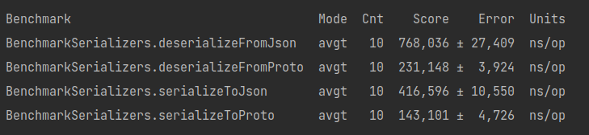

#  Результаты лабораторной № 3
## Jackson vs Protobuf

openjdk 17.1 
Ubuntu 22.04.1 
Intel® Core™ i5-8300H CPU @ 2.30GHz × 8  
Ram: 16,0 ГиБ

### Выводы:
1. Сериализация и десериализация оказались намного быстрее через protobuf,
скорее всего из-за того, что в protobuf используется размер каждого поля, что позволяет быстрее
десериализовывать объекты. Скорость сериализации обоснована тем, что внутренняя имплементация protobuf использует сжатие данных.
2. Protobuf имеет смысл использовать при наличии жестких ограничений на время сериализации и десериализации,
также при ограничениях на передаваемый размер данных
3. Json имеет смысл использовать при отсутствии сильных ограничений по времени и памяти.
4. Json формат значительно проще читать